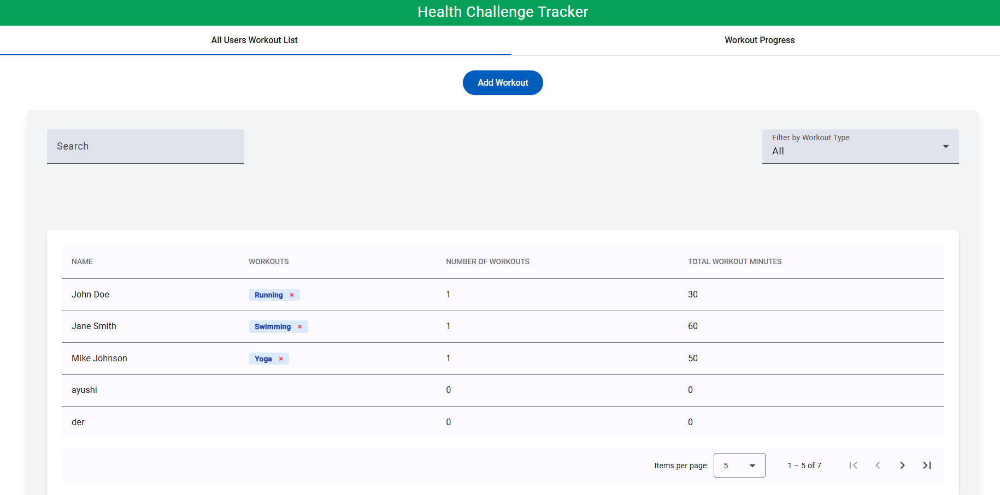
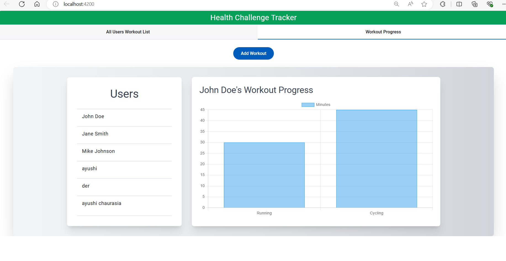
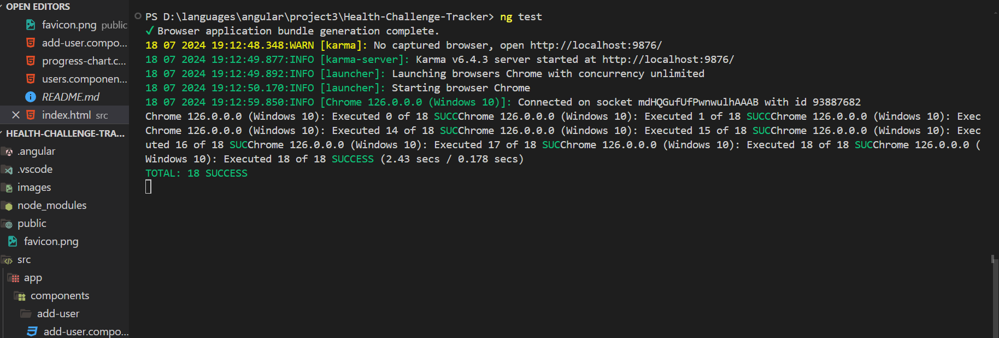
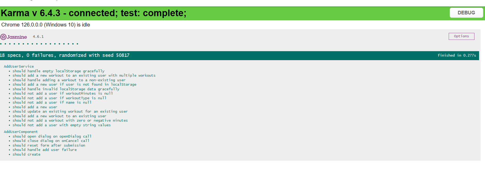

# Health Challenge Tracker

A health challenge tracker application built with  [Angular CLI](https://github.com/angular/angular-cli) version 18.1.0. Users can add their workouts, filter by workout type, and view their progress in a chart.
It is single-page application (SPA) that takes inputs
- User name
- Workout Type
- Workout minutes

## Hosted URL

The application is hosted at [https://splendid-truffle-28c0f2.netlify.app/]

## Website

## Run in Local

- Clone the repo.
- Install dependencies using `npm install`.
- Run `ng serve` for a dev server. Navigate to `http://localhost:4200/`. The application will automatically reload.

## Running unit tests

Run `ng test` to execute the unit tests via [Karma](https://karma-runner.github.io).

##  100% code coverage with the code coverage report 

## Running unit tests

Run `ng test` OR `npm run test` to execute the unit tests via [Karma](https://karma-runner.github.io).
Run `npm run test:cov` to execute the unit tests via [Karma](https://karma-runner.github.io).

